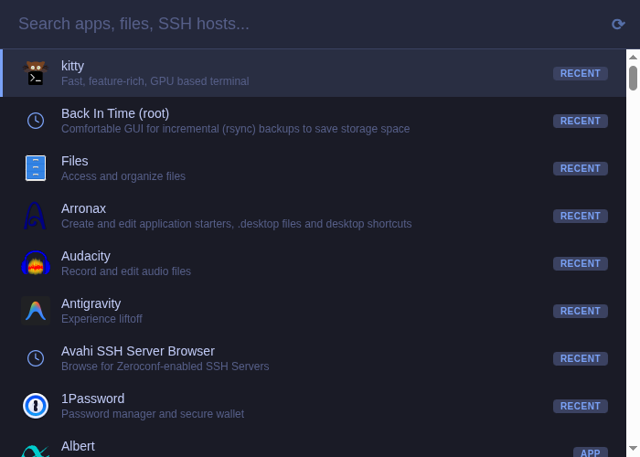
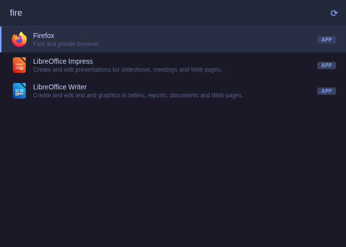
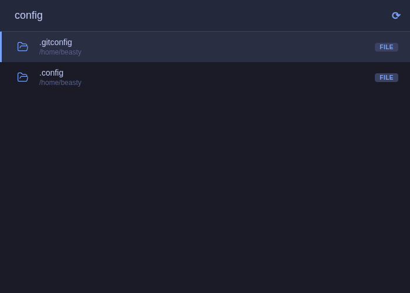

<div align="center">

# Burrow

**A fast, keyboard-driven application launcher for Linux**

[](https://github.com/beastyrabbit/burrow)
[](https://v2.tauri.app/)
[](https://www.rust-lang.org/)
[](https://wayland.freedesktop.org/)
[](LICENSE)
[](https://github.com/beastyrabbit/burrow/stargazers)

One input bar. Apps, files, AI chat, SSH, passwords, math — all at your fingertips.



</div>

---

## Features

- **App search** — Fuzzy-match installed desktop applications, ranked by frecency (frequency + recency)
- **File search** — Find files by name across configured directories
- **Content search** — Semantic search over file contents using Ollama embeddings and cosine similarity
- **SSH hosts** — Search and connect to hosts from `~/.ssh/config`
- **1Password** — Search and auto-type or copy credentials via 1Password CLI
- **Calculator** — Inline math evaluation with copy support
- **AI chat** — Conversational AI with optional RAG context from indexed files (Ollama or OpenRouter)
- **Launch history** — Frecency-ranked recent launches for instant access
- **Special commands** — Extensible `#`-prefixed commands (e.g. `#cowork`)
- **Modifier keys** — Shift+Enter and Ctrl+Enter trigger alternate actions per category (see [MODIFIERS.md](MODIFIERS.md))

<table>
<tr>
<td></td>
<td></td>
</tr>
<tr>
<td align="center"><em>Fuzzy app search</em></td>
<td align="center"><em>File search</em></td>
</tr>
</table>

## Quick Start

### Requirements

- Linux with Wayland
- [Tauri v2 prerequisites](https://v2.tauri.app/start/prerequisites/)
- `wtype` and `wl-copy` for typing and clipboard
- [Ollama](https://ollama.com/) for content search and AI chat (optional)
- [1Password CLI](https://developer.1password.com/docs/cli/) for password integration (optional)

### Install

```bash
git clone https://github.com/beastyrabbit/burrow.git
cd burrow
pnpm install

# Development (hot-reload)
pnpm tauri dev

# Production build
pnpm tauri build
```

The production binary is output to `src-tauri/target/release/burrow`.

## Usage

### Query Prefixes

Type a prefix to route your query to a specific provider:

| Prefix | Provider | Example |
|--------|----------|---------|
| *(none)* | App search (or math if expression detected) | `firefox`, `2+2` |
| ` ` (space) | File search | ` notes.md` |
| ` *` (space + asterisk) | Content/vector search | ` *rust lifetime` |
| `!` | 1Password | `!github` |
| `ssh ` | SSH hosts | `ssh prod` |
| `#` | Special commands | `#cowork` |
| `?` | AI chat | `?explain this error` |

An empty query shows your most frequently launched apps.

### Keyboard Shortcuts

| Key | Action |
|-----|--------|
| Enter | Execute default action |
| Shift+Enter | Alternate action (copy password, open dir in terminal, copy math result) |
| Ctrl+Enter | Secondary action (copy username, open in VS Code, copy SSH command) |
| Arrow Up/Down | Navigate results |
| Escape | Clear search / close |

See [MODIFIERS.md](MODIFIERS.md) for the full modifier key action table per category.

## CLI

Burrow includes a full CLI for managing the launcher without the GUI.

```
burrow                        Launch the GUI
burrow toggle                 Toggle window visibility
```

### Indexing

```
burrow reindex [-q]           Full reindex of all configured directories
burrow update [-q]            Incremental update (only new/modified files)
burrow index <file> [-f]      Index a single file (--force to re-index)
burrow progress               Show current indexer progress
```

### System

```
burrow health [--json]        Check system health (Ollama, Vector DB, API key)
burrow stats [--json]         Show statistics (indexed files, launch count)
burrow config [--path]        Open config file in editor (--path to print path)
```

### Daemon

```
burrow daemon                 Start the background daemon
burrow daemon start [-b]      Start daemon (--background to daemonize)
burrow daemon stop            Stop a running daemon
burrow daemon status          Check daemon status
```

### AI Chat

```
burrow chat "query"           Chat with AI (no document context)
burrow chat-docs "query"      Chat with AI using document context (RAG)
burrow chat --small "query"   Use small/fast model instead of large
burrow chat-docs --small "q"  Use small model with RAG context
```

### Models

```
burrow models list            Show current model configuration
burrow models set             Interactive model configuration
burrow models set chat_large  Configure a specific model type
```

Model types: `embedding`, `chat`, `chat_large` — Providers: `ollama`, `openrouter`

### History

```
burrow history                List recent launch history
burrow history list           List recent launch history
burrow history clear          Clear all launch history
burrow history remove <id>    Remove specific item from history
```

## Configuration

Config file: `~/.config/burrow/config.toml` — auto-created with defaults on first run.

Environment variables (`BURROW_*`) override config file values. For example, `BURROW_OLLAMA_URL` overrides `ollama.url`.

### Models

```toml
[models.embedding]
name = "qwen3-embedding:8b"
provider = "ollama"

[models.chat]
name = "gpt-oss:20b"
provider = "ollama"

[models.chat_large]
name = "gpt-oss:120b"
provider = "ollama"
```

### All Defaults

| Section | Key | Default |
|---------|-----|---------|
| `ollama` | `url` | `http://localhost:11434` |
| `ollama` | `timeout_secs` | `30` |
| `ollama` | `chat_timeout_secs` | `120` |
| `models.embedding` | `name` / `provider` | `qwen3-embedding:8b` / `ollama` |
| `models.chat` | `name` / `provider` | `gpt-oss:20b` / `ollama` |
| `models.chat_large` | `name` / `provider` | `gpt-oss:120b` / `ollama` |
| `chat` | `rag_enabled` | `true` |
| `chat` | `max_context_snippets` | `5` |
| `vector_search` | `enabled` | `true` |
| `vector_search` | `top_k` | `10` |
| `vector_search` | `min_score` | `0.3` |
| `vector_search` | `max_file_size_bytes` | `1000000` |
| `vector_search` | `index_mode` | `all` |
| `vector_search` | `index_dirs` | `~/Documents, ~/Projects, ~/Downloads` |
| `indexer` | `interval_hours` | `24` |
| `indexer` | `file_extensions` | `txt, md, rs, ts, tsx, js, py, toml, yaml, yml, json, sh, css, html, pdf, doc, docx, xlsx, xls, pptx, odt, ods, odp, csv, rtf` |
| `indexer` | `max_content_chars` | `4096` |
| `history` | `max_results` | `6` |
| `search` | `max_results` | `10` |
| `search` | `debounce_ms` | `80` |
| `openrouter` | `api_key` | `""` (empty) |

## Architecture

Burrow is a Tauri v2 app with a React + TypeScript frontend and a Rust backend. The frontend communicates with the backend through Tauri's IPC bridge (or an axum HTTP bridge on `localhost:3001` during development, enabling browser-based testing with Playwright).

Input routing is prefix-based — the router inspects the first characters of a query and dispatches to the appropriate provider. Launch history is stored in SQLite (`~/.local/share/burrow/history.db`). Semantic content search uses Ollama to generate embeddings, stored as BLOBs in a separate SQLite database (`~/.local/share/burrow/vectors.db`) with brute-force cosine similarity — no HNSW index needed at the expected scale.

## Development

```bash
# Full Tauri app with hot-reload (backend + frontend)
pnpm tauri dev

# Frontend dev server only (needs the Tauri backend running for HTTP bridge on :3001)
pnpm dev
```

## Testing

```bash
# Rust unit tests
cd src-tauri && cargo test

# Playwright e2e tests (starts pnpm tauri dev automatically if needed)
npx playwright test
```

## Project Structure

```
src/                         React frontend
  App.tsx                    Main UI component
  types.ts                   Shared types
  mock-tauri.ts              HTTP bridge client for browser/Playwright testing
src-tauri/src/               Rust backend
  cli/                       CLI (clap) — subcommands, output formatting
  commands/                  Search providers (apps, files, ssh, onepass, vectors, chat, etc.)
  actions/                   Modifier key action dispatch
  router.rs                  Query classification and search dispatch
  config.rs                  TOML configuration with env var overrides
  indexer.rs                 Background file indexer
  ollama.rs                  Ollama embedding client + cosine similarity
  chat.rs                    AI chat (Ollama / OpenRouter) with RAG context
  text_extract.rs            Document text extraction (PDF, DOCX, XLSX, etc.)
  dev_server.rs              Axum HTTP bridge for dev/testing (debug builds only)
  icons.rs                   Freedesktop icon → base64 data URI resolution
e2e/                         Playwright e2e tests
```

## Data Storage

| File | Purpose |
|------|---------|
| `~/.config/burrow/config.toml` | User configuration |
| `~/.local/share/burrow/history.db` | Launch history (SQLite) |
| `~/.local/share/burrow/vectors.db` | File content embeddings (SQLite) |
